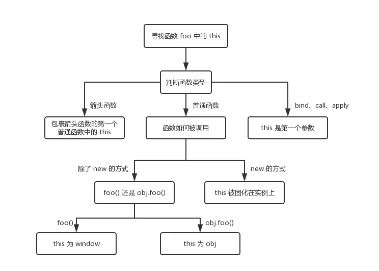

# JavaScript中的一些问题

## 原型以及原型链
### prototype
首先来介绍下 prototype 属性。这是一个显式原型属性，只有函数才拥有该属性。基本上所有函数都有这个属性，但是也有一个例外 `let fun = Function.prototype.bind()` 如果你以上述方法创建一个函数，那么可以发现这个函数是不具有 prototype 属性的。
#### prototype 如何产生的？
当我们声明一个函数时，这个属性就被自动创建了。`function Foo() {}` ,并且这个属性的值是一个对象（也就是原型），只有一个属性 constructor 对应着构造函数，也就是 Foo。<br>

### constructor
constructor 是一个公有且不可枚举的属性。一旦我们改变了函数的 prototype ，那么新对象就没有这个属性了。原型的 constructor 属性指向构造函数，构造函数又通过 prototype 属性指回原型，但是并不是所有函数都具有这个属性，Function.prototype.bind() 就没有这个属性。<br>


那么你肯定也有一个疑问，这个属性到底有什么用呢？其实这个属性可以说是一个历史遗留问题，在大部分情况下是没用的，在我的理解里，我认为他有两个作用：
- 让实例对象知道是什么函数构造了它
- 如果想给某些类库中的构造函数增加一些自定义的方法，就可以通过 xx.constructor.method 来扩展

### proto
这是每个对象都有的隐式原型属性，指向了创建该对象的构造函数的原型。其实这个属性指向了 [[prototype]]，但是 [[prototype]] 是内部属性，我们并不能访问到，所以使用 proto 来访问。<br>


因为在 JS 中是没有类的概念的，为了实现类似继承的方式，通过 proto 将对象和原型联系起来组成原型链，得以让对象可以访问到不属于自己的属性。

#### 实例对象的 proto 如何产生的
从上图可知，当我们使用 new 操作符时，生成的实例对象拥有了 proto属性。所以可以说，在 new 的过程中，新对象被添加了 proto 并且链接到构造函数的原型上。在调用 new 的过程中会发生四件事情
1. 新生成了一个对象
2. 链接到原型
3. 绑定 this
4. 返回新对象

### 为什么Function.proto等于Function.prototype
对于对象来说，xx.proto.contrcutor 是该对象的构造函数，但是在图中我们可以发现 Function.proto === Function.prototype，难道这代表着 Function 自己产生了自己?答案肯定是否认的，要说明这个问题我们先从 Object 说起。

从图中我们可以发现，所有对象都可以通过原型链最终找到 Object.prototype ，虽然 Object.prototype 也是一个对象，但是这个对象却不是 Object 创造的，而是引擎自己创建了 Object.prototype 。所以可以这样说，所有实例都是对象，但是对象不一定都是实例。

接下来我们来看 Function.prototype 这个特殊的对象，如果你在浏览器将这个对象打印出来，会发现这个对象其实是一个函数。

`Function.prototype//ƒ () { [native code] }`

我们知道函数都是通过 new Function() 生成的，难道 Function.prototype 也是通过 new Function() 产生的吗？答案也是否定的，这个函数也是引擎自己创建的。首先引擎创建了 Object.prototype ，然后创建了 Function.prototype ，并且通过 proto 将两者联系了起来。这里也很好的解释了上面的一个问题，为什么 let fun = Function.prototype.bind() 没有 prototype 属性。因为 Function.prototype 是引擎创建出来的对象，引擎认为不需要给这个对象添加 prototype 属性。
有了 Function.prototype 以后才有了 function Function() ，然后其他的构造函数都是 function Function() 生成的。

现在可以来解释 Function.proto === Function.prototype 这个问题了。因为先有的 Function.prototype 以后才有的 function Function() ，所以也就不存在鸡生蛋蛋生鸡的悖论问题了。对于为什么 Function.proto 会等于 Function.prototype ，个人的理解是：其他所有的构造函数都可以通过原型链找到 Function.prototype ，并且 function Function() 本质也是一个函数，为了不产生混乱就将 function Function() 的 proto 联系到了 Function.prototype 上。

### 总结

1. Object 是所有对象的爸爸，所有对象都可以通过 proto 找到它
2. Function 是所有函数的爸爸，所有函数都可以通过 proto 找到它
3. Function.prototype 和 Object.prototype 是两个特殊的对象，他们由引擎来创建
4. 除了以上两个特殊对象，其他对象都是通过构造器 new 出来的
5. 函数的 prototype 是一个对象，也就是原型
6. 对象的 proto 指向原型， proto 将对象和原型连接起来组成了原型链

## 浅拷贝和深拷贝
### 浅拷贝
浅拷贝只会拷贝一层，如果对象的第一层所有属性都为原始数据类型（boolean null undefined number string symbol），会拷贝属性的值，如果其中含有对象类型，那么该条属性会拷贝对应的地址。
浅拷贝有两种实现方式
```JavaScript
var a = {b:1};
var b = a.assign({},a);
```
```JavaScript
var a = {b:1};
var b = {...a};
```
### 深拷贝
深拷贝会为对象的每一条属性重新开辟空间，将值拷贝过来，生成的新对象是一个独立的个体，和原来的对象不会相互影响。
最简单的深拷贝就是通过json转换实现`JSON.parse(JSON.stringify(object))`，但是这样有一个问题就会丢失undefined symbol function属性，并且对象中如果有循环引用对象，这种方式会报错。开发中推荐使用 lodash 的深拷贝函数。我们可以实现一个简易版的深拷贝函数。
```JavaScript
function deepCopy(obj){
	function isObject(o){
		return o!=null && (typeof o === 'object' || typeof o === 'function')
	}
	let isArray = Array.isArray(obj);
	let newObj = isArray ? [...obj] : {...obj};
	Reflect.ownKeys(newObj).forEach(function(e){
		newObj[e] = isObject(obj[e]) ? deepCopy(obj[e]) : obj[e];
	});
	return newObj;
}
```

## 闭包
个人理解闭包就是定义在函数内部，可以用来访问函数内部变量的函数。最近遇到的一个闭包问题就是在for循环中使用setTimeout函数。
```JavaScript
for(var i=0;i<=10;i++){
    setTimeout(() => {
        console.log(i);
    }, i*1000);
}
```
上面函数会打印十个11，这并不是我们想要的结果。我们可以使用闭包解决这个问题。
```JavaScript
for(var i=0;i<=10;i++){
    (function(i){
        setTimeout(() => {
            item.width = (i*10)+"%";
            if(i==10){
                item.Attachment = name.length>9 ? name.substring(0,6)+"..."+name.substring(name.length-3,name.length) : name;
                item.status = "completed";
            }
        }, i*1000);
    })(i);
}
```
另外还有两种解决方式
个人理解闭包就是定义在函数内部，可以用来访问函数内部变量的函数。最近遇到的一个闭包问题就是在for循环中使用setTimeout函数。
```JavaScript
for(let i=0;i<=10;i++){
    setTimeout(() => {
        console.log(i);
    }, i*1000);
}
```
```JavaScript
for(var i=0;i<=10;i++){
    setTimeout(() => {
        console.log(i);
    }, i*1000,i);
}
```
## this作用域
在我理解js中this作用域指向调用他的对象，但是在我查阅一些资料后，发现这个答案不全面，针对单个规则的，我们可以看下雨判断作用域。



当发生多个规则同时出现的情况，这时候不同的规则之间会根据优先级最高的来决定 this 最终指向哪里，new>bind>obj.foo()>foo()，同时，箭头函数的 this 一旦被绑定，就不会再被任何方式所改变。
## js的几种继承方式
推荐看阮一峰老师的封装继承三件套

http://www.ruanyifeng.com/blog/2010/05/object-oriented_javascript_encapsulation.html<br>
http://www.ruanyifeng.com/blog/2010/05/object-oriented_javascript_inheritance.html<br>
http://www.ruanyifeng.com/blog/2010/05/object-oriented_javascript_inheritance_continued.html<br>
总结一下继承分为构造函数的基础和非构造函数的继承
### 构造函数的继承
```JavaScript
function Animal(){
    this.species = "动物";
}
function Cat(name,color){
　　this.name = name;
　　this.color = color;
}
```
现在我们要将猫的构造函数继承动物的构造函数<br>
1、构造函数绑定
```JavaScript
//改写Cat
function Cat(name,color){
　　Animal.apply(this, arguments);
　　this.name = name;
　　this.color = color;
}
```
2、prototype模式
```JavaScript
Cat.prototype = new Animal();
Cat.prototype.constructor = Cat;//必须要有这一步不然会造成原型链紊乱
```
3、直接继承prototype（不推荐这种，这种修改Cat的原型会影响Animal的原型 Animal.prototype.constructor === Cat）
```JavaScript
//改写Animal
function Animla(){};
Animal.prototype.species = "动物";
//继承
Cat.prototype = Animal.prototype;
Cat.prototype.constructor = Cat;//必须要有这一步不然会造成原型链紊乱
```
4、利用空对象作为中介，这样会解决上面3遇到的问题
```JavaScript
//改写Animal
function Animla(){};
Animal.prototype.species = "动物";
//继承
function extend(Child, Parent) {
　　var F = function(){};
　　F.prototype = Parent.prototype;
　　Child.prototype = new F();
　　Child.prototype.constructor = Child;
　　Child.uber = Parent.prototype;//这个属性直接指向父对象的prototype属性。（uber是一个德语词，意思是"向上"、"上一层"。）这等于在子对象上打开一条通道，可以直接调用父对象的方法。这一行放在这里，只是为了实现继承的完备性，纯属备用性质。
}
```
5、拷贝继承
```JavaScript
function extend2(Child, Parent) {
　　var p = Parent.prototype;
　　var c = Child.prototype;
　　for (var i in p) {
　　　　c[i] = p[i];
　　}
　　c.uber = p;
}
```
### 非构造函数的继承
非构造函数的继承在我看来也就是对象的继承。下面两个对象，我们要实现医生继承中国人，成为一个中国医生的对象。
```JavaScript
var Chinese = {
　　nation:'中国'
};
var Doctor ={
　　career:'医生'
}
```
1、object()方法
```JavaScript
function object(o) {
　　function F() {}
　　F.prototype = o;
　　return new F();
}
var Doctor = object(Chinese);
Doctor.career = '医生';
```
2、浅拷贝

参考上面浅拷贝深拷贝详解

3、深拷贝

参考上面浅拷贝深拷贝详解

## Event Loop
js在浏览器中是单线程执行的，他还有一个特性是非阻塞性的，当我们调取一个ajax请求，异步执行以后，js会先把这个任务挂起（peddling），然后Ajax返回结果后，通过一定的机制执行回调，这个机制就是我们下面要说的js的事件循环机制
### js执行栈以及执行环境

### js事件队列

