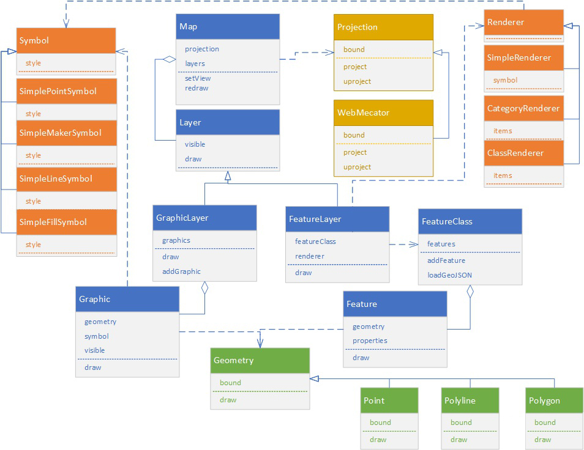
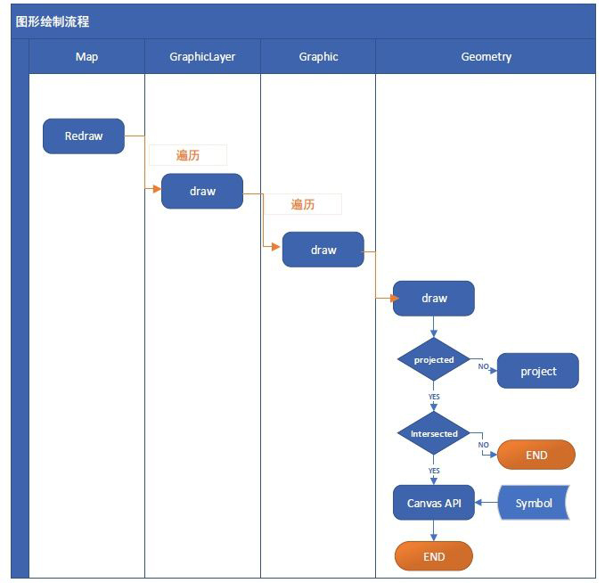
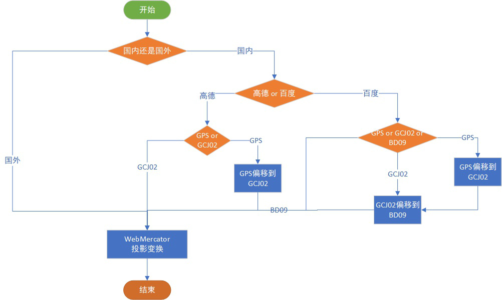
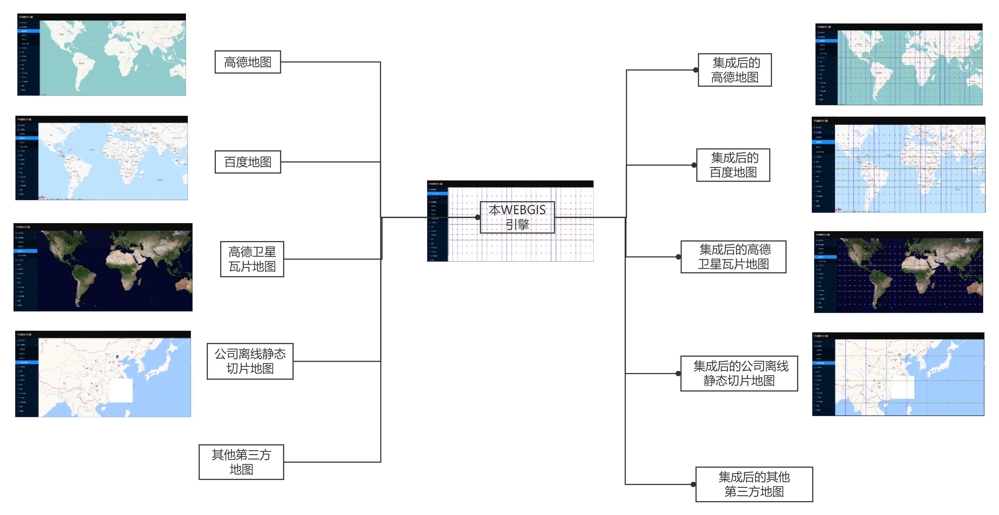
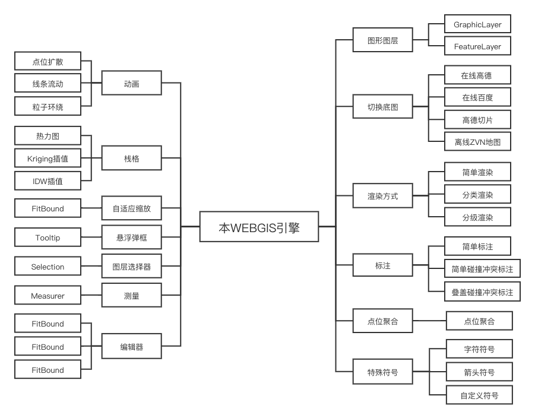

# gis总结

## 技术背景

在项目中经常会使用到gis地图,市场上有高德地图、百度地图、腾讯地图，换有一些地图引擎arcgis、openlayer等,各种厂商的地图对接会造成极大的工作量和重复劳动，基于这个问题，目前有两种解决办法。

## 解决方案

1. 我司封装的znvmap地图组件、其中封装的多个厂商的API、保障了对外API的一致性，即可实现一次编码，多种地图的无缝切换。<https://www.npmjs.com/package/znvmap>
2. 盛政老师的greengis，开发一套新的gisAPI，但是通过一个巧妙的方法将greengis的图层和地图图层关联。<https://www.zhihu.com/people/sheng-zheng-10/zvideos>

## 关键技术

1. 基础矩阵变换知识，包含平移缩放，实现地图缩放漫游方法。
2. 投影变换实现，将 __GPS坐标__ -> __地理平面坐标__ -> __屏幕坐标__ 关联起来。
3. 图层关联技术，将多个canvas图层通过设置中心点缩放级别，使他们完全重叠。
4. API设计，包含Map、Projection、Symbol、Graphic、GraphicLayer、Feature、FeatureLayer、FeatureClass、Geometry、Point、Polyline、Polygon等的设计

## 参考图片

### 系统架构图

### 绘制流程图

### 第三方地图集成方式

### 第三方地图集成效果

### 引擎功能总览

## 输出技术方案

1. [green-gis-react-ts](https://github.com/18134906388/green-gis-react-ts)
2. 专利《一种基于WEBGIS的多地图对接可视化引擎实现方法与装置》
