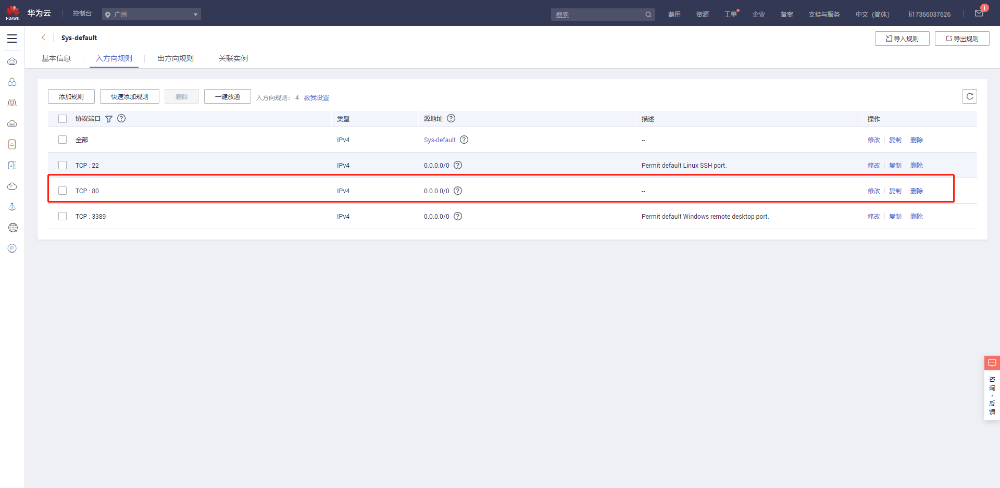

# 云服务器配置

## 基本信息
华为云服务器 镜像信息：CentOS 7.6 64bit with SRIOV

## Nginx安装
### 下载安装包
`wget -c http://nginx.org/download/nginx-1.16.0.tar.gz` 或拷贝本地安装包
### 解压
`tar -zxvf nginx-1.16.0.tar.gz`
### 生成配置文件
`cd nginx-1.16.0`
`./configure` 如果在这里报错（./configure: error: the HTTP rewrite module requires the PCRE library.） 先安装`yum -y install openssl openssl-devel`
`make -j4 && make install`
### 编译安装
`make && make install`编译并安装 `make`单纯使用make是编译，这时会在obj文件夹下面生成新的nginx文件，常用来新增模块。
### 启动nginx
`cd /usr/local/nginx/sbin/nginx`
### 修改安全组

### 查看防火墙状态
`firewall-cmd --state`
### 查看所有打开的端口
`firewall-cmd --zone=dmz --list-ports`
### 配置防火墙
```
firewall-cmd --zone=public --add-port=8080/tcp --permanent
firewall-cmd --reload
firewall-cmd --complete-reload
```

## SSL配置

### 生成一个key

`openssl genrsa -des3 -out ssl.key 1024`

然后他会要求你输入这个key文件的密码。不推荐输入。因为以后要给nginx使用。每次reload nginx配置时候都要你验证这个PAM密码的。
由于生成时候必须输入密码。你可以输入后 再删掉。

``` shell
mv ssl.key xxx.key
openssl rsa -in xxx.key -out ssl.key
rm xxx.key
```

### 根据这个key文件生成证书请求文件

`openssl req -new -key ssl.key -out ssl.csr`
以上命令生成时候要填很多东西 一个个看着写吧（可以随便，毕竟这是自己生成的证书）

### 生成crt证书文件

`openssl x509 -req -days 365 -in ssl.csr -signkey ssl.key -out ssl.crt`

这里365是证书有效期 推荐3650哈哈。这个大家随意。最后使用到的文件是key和crt文件。

如果需要用pfx 可以用以下命令生成

`openssl pkcs12 -export -inkey ssl.key -in ssl.crt -out ssl.pfx`

### nginx配置文件的server节点配置

``` nginx
server {
listen 443;
server_name bbs.nau.edu.cn;

if ($uri !~ "/logging.php$") {
rewrite ^/(.)$ http://$host/$1 redirect;
}
ssl on;
ssl_certificate /home/ssl.crt;
ssl_certificate_key /home/ssl.key;
ssl_session_timeout 5m;
ssl_protocols SSLv2 SSLv3 TLSv1;
ssl_ciphers ALL:!ADH:!EXPORT56:RC4+RSA:+HIGH:+MEDIUM:+LOW:+SSLv2:+EXP;
ssl_prefer_server_ciphers on;

}
```

## MySql安装
### 下载安装包
https://dev.mysql.com/downloads/mysql/
或者拷贝本地tar包  mysql-5.7.28-1.el7.x86_64.rpm-bundle.tar
### 解压
`tar xvf mysql-5.7.28-1.el7.x86_64.rpm-bundle.tar`
### 安装
#### 安装依赖 
`yum install libaio`
#### 安装rpm包 
```Shell
rpm -ivh mysql-community-common-5.7.28-1.el7.x86_64.rpm
rpm -ivh mysql-community-libs-5.7.28-1.el7.x86_64.rpm
rpm -ivh mysql-community-client-5.7.28-1.el7.x86_64.rpm
rpm -ivh mysql-community-server-5.7.28-1.el7.x86_64.rpm
```
如果报错error: Failed dependencies:

mysql-community-common(x86-64) >= 5.7.9 is needed by 

mysql-community-libs-5.7.28-1.el7.x86_64

mariadb-libs is obsoleted by mysql-community-libs-5.7.28-1.el7.x86_64

清除yum里所有mysql依赖包再执行安装
```Shell
rpm -qa|grep mysql
yum remove mysql-libs
```
### 验证安装状态
```Shell
mysqladmin --version
>>mysqladmin  Ver 8.42 Distrib 5.7.28, for Linux on x86_64
```
### Mysql 初始化并查看初始临时密码
#### MySQL服务初始化
`mysqld --initialize`
#### 查看初始临时密码
`grep 'temporary password' /var/log/mysqld.log | tail -1`
### 修改mysql数据库目录的所属用户及其所属组
`chown -R mysql:mysql /var/lib/mysql`
### 启动MySQL服务
#### 查看当前的mysqld服务状态
`systemctl status mysqld`
#### 将mysqld服务设置为开机启动
`systemctl enable mysqld`
#### 启动mysqld服务
`systemctl start mysqld`
### 登录MySQL修改密码并设置允许远程登陆
```
mysql -uroot -p
Enter password:
mysql> set password=password('******');
mysql>use mysql;
mysql>update user set host='%' where user='root';
mysql>flush privileges;
```
### 配置my.cnf
#### 查看/etc/my.cnf
`cat /etc/my.cnf`
#### 编辑/etc/my.cnf
`bind-address=0.0.0.0`
### 查看防火墙状态
`firewall-cmd --state`
### 查看所有打开的端口
`firewall-cmd --zone=dmz --list-ports`
### 配置防火墙
```
firewall-cmd --zone=public --add-port=3306/tcp --permanent
firewall-cmd --reload
firewall-cmd --complete-reload
```

