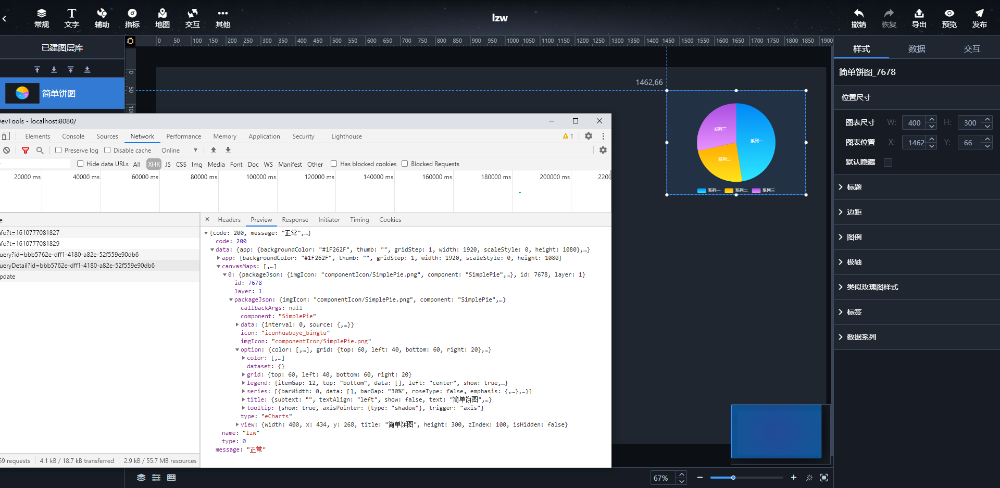

# 大数据可视化平台

## 技术背景

公司大量的前端可视化项目、组件复用率低、交由第三方开发无法模块化集成、开发周期长、同类产品报价较高等等这些原因导致了这个项目的诞生。

## 技术预研

参考业内厂商的可视化系统，袋鼠云、datav、四方伟业等，对多组件丰富度、使用体验、可实现页面繁杂度、实现技术选型等多个维度进行预研。

## 关键技术

### 组件数据结构

组件文件结构为

- XXX.js Export出一个Object其中包含组件的默认信息：初始宽高、属性、样式、数据
- XXX.vue 组件业务逻辑实现的地方、包含组件绑定的数据发展变化后的逻辑处理、以及自身的业务逻辑
- XXXForm.vue 组件属性表单编排逻辑实现的地方
- XXXEvent.vue 组件自定义事件编排逻辑实现的地方

通过对这个文件读取，进行组件自动注册，将组件注册到系统中，以方便后续的编排

``` json
├── id
├── layer
├── packageJson
│   ├── callbackArgs
│   ├── component
│   ├── data
│       ├── interval
│       └── source
│           ├── ds_apiBodyParams
│           ├── ds_apiPath
│           ├── ds_apiRequestType
│           ├── ds_apiUrlParams
│           ├── ds_dataSourceId
│           ├── ds_filterCode
│           ├── ds_filterIsOpen
│           ├── ds_originalObj
│           ├── ds_resultObj
│           ├── ds_type
│           ├── ds_useHttpServerProxy
│           └── ds_resultObjTemplate
│   ├── icon
│   ├── imgIcon
│   ├── option
│   ├── type
│   └── view
│       ├── height
│       ├── width
│       ├── title
│       ├── isHidden
│       ├── x
│       └── y
├── ...
```



### 组件数据加载

### 组件事件注册

### 可视化编排技术

### 代码逆向导出
